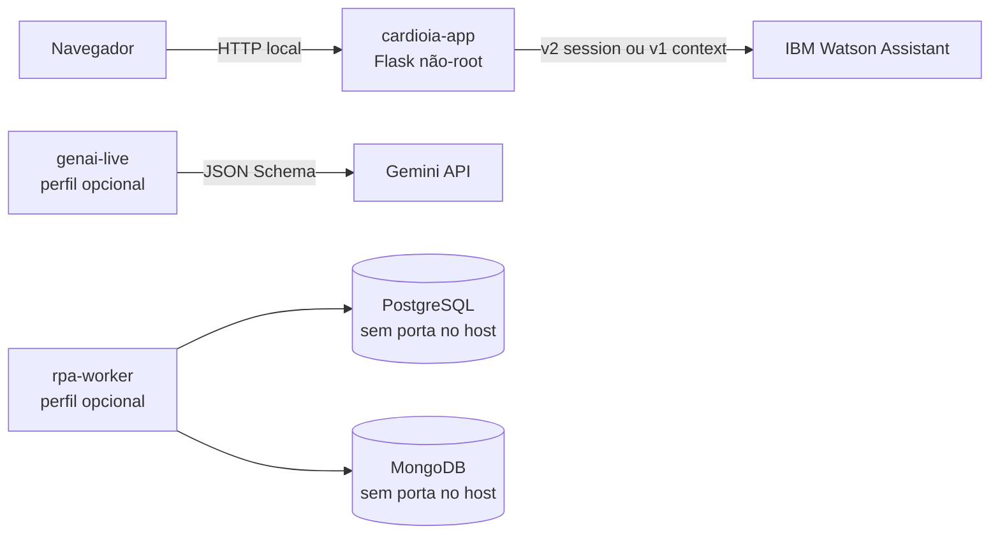

# Arquitetura executada

- O MVP padrão sobe somente `cardioia-app`.
- Watson e Gemini são serviços externos; as chaves são Compose secrets.
- `genai` e `rpa` são perfis independentes.
- A rede `rpa-internal` é interna e não se conecta ao navegador.
- Volumes RPA persistem somente massa fictícia.
