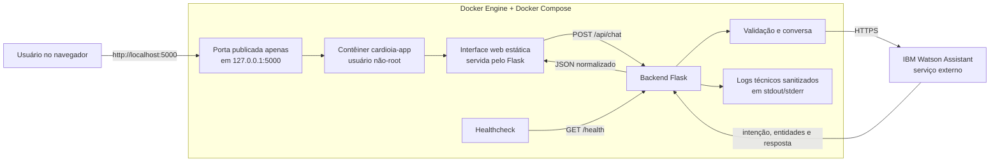
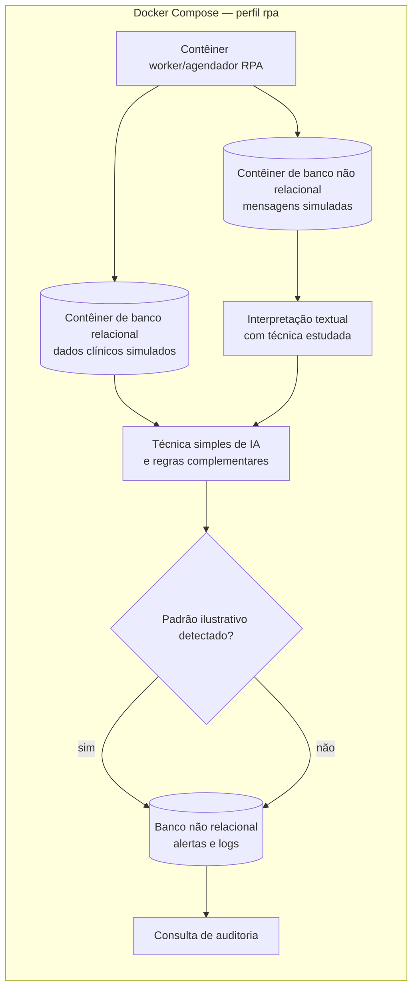

# CardioIA — Plano de Implementação da Fase 5

**Documento-base:** [`enunciado.md`](enunciado.md)

## 1. Visão geral

Este documento transforma o enunciado da Fase 5 em um plano executável para a construção de um protótipo funcional de **Assistente Cardiológico Conversacional**. A estratégia prioriza primeiro o escopo explicitamente avaliado em 10 pontos e trata as propostas **Ir Além 1** e **Ir Além 2** como blocos adicionais independentes, iniciados somente depois da estabilização do produto mínimo viável (MVP), caso sua inclusão seja confirmada com o professor.

O CardioIA terá finalidade exclusivamente acadêmica e demonstrativa. Ele poderá organizar informações relatadas pelo usuário e apresentar orientações gerais, mas não deverá diagnosticar doenças, prescrever tratamentos, substituir profissionais de saúde ou prometer monitoramento clínico real.

### 1.1 Objetivo do produto

Entregar uma aplicação na qual o usuário:

1. digita uma mensagem em linguagem natural;
2. acessa uma aplicação Flask executada obrigatoriamente em um contêiner Docker;
3. tem sua mensagem encaminhada pelo backend Python conteinerizado ao IBM Watson Assistant;
4. recebe uma resposta contextualizada em uma interface simples; e
5. encontra mensagens claras sobre os limites do protótipo e sobre a necessidade de procurar atendimento adequado em situações potencialmente urgentes.

### 1.2 Estratégia de entrega

O projeto será desenvolvido em três camadas de prioridade:

- **Camada 1 — MVP obrigatório:** fluxo conversacional no Watson Assistant, integração com backend Flask executado em Docker, interface web funcional, testes, documentação, repositório público e vídeo.
- **Camada 2 — Ir Além 1:** extração estruturada de informações clínicas simuladas com IA Generativa, se esse bloco fizer parte da entrega combinada com o professor.
- **Camada 3 — Ir Além 2:** automação periódica com RPA, IA simples e dados relacionais e não relacionais, sob a mesma confirmação.

Cada camada deverá funcionar de forma independente. Um bloco adicional, quando incluído, não poderá comprometer a execução ou a demonstração do MVP.

O enunciado usa a expressão “Ir Além”, mas não declara formalmente a obrigatoriedade nem atribui uma quantidade específica de pontos a esses dois blocos. Antes de investir prazo neles, a equipe deverá confirmar com o professor como serão considerados e não presumir que substituem qualquer item dos 10 pontos explícitos.

**Decisão de execução:** todo componente executável desenvolvido pela equipe será entregue e demonstrado em contêineres Docker. O comando canônico do MVP será `docker compose up --build --wait`; o IBM Watson Assistant continuará sendo consumido como serviço externo.

---

## 2. Premissas e restrições

### 2.1 Premissas

- A equipe terá acesso a uma instância do IBM Watson Assistant compatível com os exemplos apresentados nas aulas.
- O backend será implementado em Python com Flask, seguindo o exemplo indicado no enunciado.
- A execução oficial do projeto será feita por **Docker Engine/Docker Desktop em modo Linux containers, com Docker Compose v2**, tanto no desenvolvimento integrado quanto nos testes finais e na demonstração.
- O Watson Assistant permanecerá como serviço externo; somente a aplicação CardioIA e, quando aplicável, os componentes locais dos blocos “Ir Além” serão conteinerizados.
- Para reduzir prazo e risco, a interface recomendada para o MVP será HTML, CSS e JavaScript. React Native deverá ser escolhido somente se já fizer parte do domínio da equipe e do conteúdo permitido.
- Serão usados apenas dados fictícios e cenários simulados.
- O repositório deverá ser público, mas isso não significa tornar o chat ou a API públicos; a demonstração recomendada será local ou restrita à equipe e aos avaliadores.
- A equipe será formada, preferencialmente, por 4 ou 5 integrantes para atender à recomendação de colaboração e se habilitar ao ponto extra.
- Nomes de classes, métodos e parâmetros do SDK do Watson deverão seguir a versão efetivamente usada no material didático e na instância disponibilizada à equipe.

### 2.2 Restrições

- Usar exclusivamente abordagens, ferramentas e exemplos autorizados pelo material didático.
- Iniciar a aplicação por `docker compose up --build --wait`; executar `python app.py` diretamente no host poderá ser usado apenas para depuração individual e não contará como procedimento oficial de entrega.
- Não armazenar nomes, documentos, contatos, credenciais ou dados reais de saúde.
- Antes do primeiro envio, avisar: “Não insira dados pessoais nem informações reais de saúde. As mensagens desta demonstração são processadas por um serviço externo de NLP.”
- Não publicar chaves, URLs privadas, tokens ou segredos no GitHub.
- Não apresentar a saída do assistente como diagnóstico ou recomendação médica individualizada.
- Manter o vídeo de demonstração com duração máxima de 3 minutos.
- Manter o relatório obrigatório do MVP entre 1 e 2 páginas.

### 2.3 Fora do escopo do MVP

- prontuário eletrônico real;
- autenticação de pacientes;
- integração com hospitais, laboratórios, dispositivos ou serviços de emergência;
- exposição pública da API ou do chat na internet; uma mudança desse escopo exigirá autenticação/restrição de rede, limites de uso e testes adicionais antes da publicação;
- decisão clínica automatizada;
- prescrição de medicamentos;
- uso de dados pessoais ou clínicos reais;
- disponibilidade, segurança e conformidade próprias de um sistema de produção.
- Kubernetes, registry público de imagens, alta disponibilidade e orquestração de produção.

---

## 3. Requisitos rastreáveis

### 3.1 Requisitos funcionais do MVP

| ID | Requisito | Evidência esperada |
|---|---|---|
| RF-01 | Permitir que o usuário envie mensagens em linguagem natural. | Campo de texto, botão de envio e demonstração no vídeo. |
| RF-02 | Classificar mensagens por meio de intents no Watson Assistant. | Configuração/exportação do assistente e testes do fluxo. |
| RF-03 | Reconhecer informações relevantes por meio de entities. | Entidades configuradas, exemplos e evidência de reconhecimento. |
| RF-04 | Conduzir um fluxo de atendimento inicial por dialog nodes. | Diagrama/descrição do fluxo e conversas de teste. |
| RF-05 | Produzir respostas contextualizadas. | Respostas distintas conforme intenção, entidade e contexto. |
| RF-06 | Tratar mensagens não reconhecidas e exceções básicas. | Fallback, nova tentativa e mensagens de indisponibilidade. |
| RF-07 | Integrar o backend Python ao Watson Assistant pela API do serviço. | Código, configuração por ambiente e execução ponta a ponta. |
| RF-08 | Exibir na interface as mensagens do usuário e do assistente. | Histórico visual durante a conversa. |
| RF-09 | Sinalizar limites do protótipo e orientar procura de atendimento em cenários críticos simulados. | Aviso inicial, respostas de segurança e casos de teste. |
| RF-10 | Manter conversas separadas. | `conversation_id` opaco e teste com duas conversas independentes. |
| RF-11 | Organizar as informações clínicas simuladas de modo estruturado e compreensível, com confirmação e possibilidade de correção. | Resumo por campos, CT-04, CT-06 e CT-07. |
| RF-12 | Automatizar a progressão do atendimento por condições, contexto e dialog nodes do Watson. | Fluxo exportado e testes de transição entre nós. |

### 3.2 Requisitos não funcionais do MVP

| ID | Requisito | Critério verificável |
|---|---|---|
| RNF-01 | Clareza | Textos curtos, linguagem simples e ausência de jargão desnecessário. |
| RNF-02 | Usabilidade | Enviar uma mensagem exige no máximo digitar e acionar Enviar/Enter. |
| RNF-03 | Organização | Código separado por responsabilidades e nomes consistentes. |
| RNF-04 | Segurança de configuração | Segredos somente em variáveis de ambiente; arquivo `.env` ignorado pelo Git. |
| RNF-05 | Privacidade | Dados e logs exclusivamente fictícios, sem conteúdo pessoal real. |
| RNF-06 | Resiliência | Falhas de rede, timeout ou indisponibilidade geram mensagem compreensível, sem stack trace na interface. |
| RNF-07 | Rastreabilidade | Requisitos, testes e entregáveis possuem correspondência explícita neste plano. |
| RNF-08 | Reprodutibilidade | O `README.md` permite configurar e executar o projeto do zero. |
| RNF-09 | Acessibilidade básica | Contraste legível, rótulo no campo, foco visível e operação por teclado. |
| RNF-10 | Conteinerização | A aplicação é construída e executada por Docker Compose, sem depender de Python instalado diretamente no host. |

No MVP, a “automação” citada no objetivo geral é atendida pela orquestração automática dos dialog nodes, condições, contexto, perguntas e respostas do Watson. O RPA periódico é tratado separadamente no **Ir Além 2** e não é presumido como substituto do fluxo conversacional.

### 3.3 Matriz de rastreabilidade

| Requisito | Fase principal | Testes/evidências | Artefato | Rubrica |
|---|---|---|---|---|
| RF-01 e RF-08 | Fase 4 | CT-12, CT-17 e CT-18; vídeo | Interface web | Interface funcional |
| RF-02, RF-03 e RF-04 | Fase 2 | CT-01 a CT-11; validação de intent, entity e node | Export JSON e fluxo | Fluxo conversacional |
| RF-05 e RF-11 | Fases 2 e 4 | CT-03, CT-04, CT-06 e CT-07 | Respostas, resumo e vídeo | Fluxo e interface |
| RF-06 | Fases 2 e 3 | CT-09, CT-10, CT-14 e CT-15 | Fallback e tratamento de erros | Fluxo e integração |
| RF-07 | Fase 3 | CT-14 a CT-16; chamada ponta a ponta | Backend Python | Integração |
| RF-09 | Fases 2 a 4 | CT-08, CT-14, CT-19 e CT-22 | Nós e mensagens fixas de segurança | Fluxo e documentação |
| RF-10 | Fases 3 e 4 | CT-16 e testes de expiração/reinício | Serviço de conversa | Integração e organização |
| RF-12 | Fase 2 | Transições previstas, fallback e contexto nos CT-03 a CT-10 | Dialog nodes exportados | Fluxo conversacional |
| RNF-01, RNF-02 e RNF-09 | Fase 4 | CT-18 e revisão visual | Interface e vídeo | Interface funcional |
| RNF-03 e RNF-08 | Fases 1 e 5 | Clone limpo e checklist de revisão técnica | Estrutura e `README.md` | Organização do código |
| RNF-04 e RNF-05 | Fases 1, 3 e 5 | CT-23 e varredura de arquivos/histórico | `.env.example`, `.gitignore` e logs | Organização e documentação |
| RNF-06 | Fase 3 | CT-14 e CT-15 | Respostas de erro | Integração |
| RNF-07 | Fases 0, 5 e 6 | Esta matriz e registros preenchidos | Plano, testes e relatório | Documentação |
| RNF-08 e RNF-10 | Fases 1, 5 e 6 | Build limpo, healthcheck e reprodução em outra máquina | `Dockerfile`, `compose.yaml`, `.dockerignore` e `README.md` | Organização e documentação |

---

## 4. Arquitetura proposta para o MVP



Para o MVP, o próprio Flask servirá a interface e a API na mesma origem dentro do contêiner `cardioia-app`. O Docker Compose publicará somente a porta da aplicação e a limitará ao endereço local `127.0.0.1`. O navegador continuará fora do contêiner, enquanto o backend acessará o Watson pela rede externa. O healthcheck verificará `/health` sem considerar o sistema clinicamente validado.

### 4.1 Responsabilidades por componente

| Componente | Responsabilidades | Não deve fazer |
|---|---|---|
| Interface | Capturar mensagem, indicar carregamento, mostrar histórico e erros amigáveis. | Conter credenciais do Watson ou regras clínicas sensíveis. |
| Backend Flask | Validar entrada, controlar a conversa e a eventual sessão interna, chamar o Watson, normalizar resposta e tratar erros. | Expor segredos, stack traces ou identificadores internos ao navegador. |
| Watson Assistant | Identificar intents/entities, manter contexto previsto no fluxo e selecionar respostas. | Fazer diagnóstico, prescrição ou alegar certeza clínica. |
| Logs | Apoiar depuração com horário, status, latência e identificador técnico. | Registrar chaves, texto integral da conversa ou dados pessoais. |
| Docker/Compose | Construir imagem reproduzível, injetar configuração em tempo de execução, publicar somente a porta necessária e verificar a saúde do serviço. | Gravar credenciais na imagem, executar como `root` ou publicar bancos/portas desnecessárias. |

### 4.2 Contrato mínimo da API interna

#### Verificação de disponibilidade

`GET /health`

Resposta esperada:

```json
{
  "status": "ok"
}
```

Esse endpoint confirma apenas que o backend está ativo; não representa validação médica nem garante que todos os serviços externos estejam disponíveis.

#### Envio de mensagem

`POST /api/chat`

Requisição:

```json
{
  "message": "Estou sentindo palpitações",
  "conversation_id": "identificador-opaco-opcional"
}
```

Resposta de sucesso sugerida:

```json
{
  "messages": [
    {
      "type": "text",
      "text": "Entendi. Há quanto tempo você percebe as palpitações?"
    }
  ],
  "conversation_id": "identificador-opaco-da-conversa",
  "metadata": {
    "intent": "relatar_sintoma"
  },
  "request_id": "identificador-tecnico-da-requisicao"
}
```

Resposta de erro sugerida:

```json
{
  "error": {
    "code": "ASSISTANT_UNAVAILABLE",
    "message": "Não foi possível acessar o assistente agora. Tente novamente em instantes.",
    "request_id": "identificador-tecnico-da-requisicao"
  }
}
```

Decisões do contrato:

- `message` será obrigatório, textual, terá espaços externos removidos e limite idêntico na interface e no backend; a meta interna sugerida é 1.000 caracteres, sujeita ao limite do serviço e ao material da aula.
- O endpoint aceitará `Content-Type: application/json`; JSON malformado retornará HTTP 400 e tipo de conteúdo incompatível, HTTP 415.
- Mensagem vazia retornará HTTP 400; corpo acima do limite aceito retornará erro 400 ou 413, conforme a implementação escolhida e documentada.
- `messages` preservará a ordem de todas as respostas textuais úteis devolvidas pelo Watson, sem fazer a interface depender do formato nativo do provedor.
- Falha de autenticação/configuração do Watson retornará erro controlado no servidor, sem revelar detalhes secretos.
- Falha ou resposta inválida do serviço poderá retornar HTTP 502; indisponibilidade, HTTP 503; timeout, HTTP 504.
- `metadata` conterá somente dados úteis para demonstração ou teste e poderá ser omitido da interface final.
- `conversation_id` será gerado pelo backend com valor aleatório e imprevisível; ele não será o identificador interno devolvido pelo Watson.
- Em perfil stateful, o backend mapeará `conversation_id` para a sessão do provedor. Em perfil stateless/workspace, mapeará `conversation_id` para o `context` devolvido pelo Watson, substituirá esse estado a cada resposta e o reenviará no turno seguinte. Ambos os mapas ficarão em memória, isolados por conversa e com expiração curta, sugerida em 15 minutos de inatividade.
- A interface guardará `conversation_id` em `sessionStorage`, nunca em URL ou `localStorage`, e permitirá iniciar uma nova conversa.
- Conversa ausente ou expirada retornará HTTP 410; a interface informará a perda de contexto e iniciará outra conversa mediante ação do usuário.
- O armazenamento em memória é aceitável para a demonstração em um único processo, mas perde as sessões ao reiniciar e não representa arquitetura de produção.

Antes da implementação, a equipe deverá escolher um único perfil de integração compatível com o material didático. Se a versão usa sessões, deverá documentar os identificadores e a versão de API exigidos. Se usa workspace/contexto clássico, deverá documentar esse conjunto alternativo. Os dois perfis não devem ser misturados no mesmo código.

### 4.3 Estrutura de diretórios recomendada

```text
cardioia/
├── app.py                       # inicialização do Flask
├── config.py                    # leitura e validação das variáveis de ambiente
├── requirements.txt             # dependências mínimas e versões registradas
├── Dockerfile                   # imagem da aplicação Flask
├── compose.yaml                 # execução oficial do MVP e perfis adicionais
├── .dockerignore                # exclui segredos, caches e artefatos da imagem
├── .env.example                 # nomes das variáveis, nunca valores reais
├── .gitignore
├── README.md
├── backend/
│   ├── __init__.py              # criação/configuração da aplicação Flask
│   ├── routes.py                # /health e /api/chat
│   ├── assistant_service.py     # comunicação com o Watson Assistant
│   ├── conversation_service.py  # conversa pública, estado/sessão interna e expiração
│   ├── validators.py            # validação da mensagem
│   ├── templates/
│   │   └── index.html           # interface servida por GET /
│   └── static/
│       ├── styles.css
│       └── app.js
├── watson/
│   ├── assistant-export.json    # exportação sem segredos
│   └── fluxo-conversacional.md
├── tests/
│   ├── smoke_test.py             # verificações HTTP executáveis no contêiner
│   ├── casos-conversacionais.md
│   └── casos-integracao.md
└── docs/
    ├── relatorio-mvp.pdf
    ├── roteiro-video.md
    └── evidencias/
```

Se a equipe optar por uma estrutura mais simples, ela poderá reduzir a quantidade de módulos, desde que preserve a separação entre interface, rota HTTP, integração com o Watson e configuração.

### 4.4 Configuração e segredos

O `.env.example` deverá declarar apenas os nomes esperados, por exemplo:

```dotenv
WATSON_API_KEY=
WATSON_SERVICE_URL=
WATSON_ASSISTANT_ID=
WATSON_ENVIRONMENT_ID=
WATSON_WORKSPACE_ID=
WATSON_API_VERSION=
APP_ENV=development
APP_DEBUG=false
APP_HOST=0.0.0.0
APP_PORT=5000
CARDIOIA_HOST_PORT=5000
CONVERSATION_TTL_SECONDS=900
GEMINI_API_KEY=
POSTGRES_ROOT_PASSWORD=
RPA_POSTGRES_PASSWORD=
MONGO_ROOT_PASSWORD=
RPA_MONGO_PASSWORD=
```

Os nomes exatos devem ser ajustados ao SDK e à versão usados em aula. `WATSON_ENVIRONMENT_ID` e `WATSON_WORKSPACE_ID` representam perfis alternativos; a equipe manterá apenas o conjunto exigido pelo perfil selecionado. O `.env` local conterá configuração e segredos, permanecerá ignorado pelo Git e nunca será mostrado em evidências. O Compose usará esse arquivo para interpolar os valores e injetará em cada contêiner somente as variáveis necessárias; o backend passará `WATSON_API_KEY` diretamente ao SDK sem registrá-la.

O repositório e o contexto de build deverão ignorar `.env`, outros arquivos de credenciais, caches locais e evidências por meio de `.gitignore` e `.dockerignore`. Nenhuma credencial será usada em instruções `ARG`, `ENV` ou `RUN` do `Dockerfile`. O mesmo padrão de variáveis do `.env`, com injeção restrita por serviço, será aplicado ao Gemini e às senhas dos bancos do Ir Além 2.

`APP_HOST=0.0.0.0` é necessário para que o processo Flask seja acessível através da rede do contêiner. A exposição no computador continuará restrita pelo mapeamento `127.0.0.1:${CARDIOIA_HOST_PORT:-5000}:5000` do Compose. `APP_DEBUG` permanecerá falso na demonstração.

Como versões do Docker Engine anteriores à 28.0.0 possuem uma ressalva de isolamento para portas publicadas em localhost em redes do mesmo segmento, o ambiente de entrega usará Engine 28.0.0 ou superior. Se isso não for possível, a equipe registrará uma regra de firewall compensatória e testará a inacessibilidade a partir de outra máquina, conforme o alerta da documentação oficial sobre [publicação de portas](https://docs.docker.com/engine/network/port-publishing/).

### 4.5 Execução obrigatória com Docker

O caminho oficial de execução será:

```powershell
Copy-Item .env.example .env
# preencher configuração e segredos no .env sem exibi-los no terminal ou vídeo
docker compose config --quiet
docker compose build --no-cache
docker compose up --wait
```

Após o healthcheck ficar saudável, a interface deverá abrir em `http://localhost:5000`. Como `--wait` implica execução em segundo plano, os logs serão consultados por `docker compose logs` e o encerramento normal será feito por `docker compose down`. A remoção de volumes não fará parte do comando padrão para evitar perda acidental dos dados simulados dos blocos adicionais.

O modo `config --quiet` será usado para validar sem imprimir a configuração resolvida, e `up --wait` aguardará o estado running/healthy. Esses comportamentos estão descritos na documentação oficial de [`docker compose config`](https://docs.docker.com/reference/cli/docker/compose/config/) e [`docker compose up`](https://docs.docker.com/reference/cli/docker/compose/up/). O vídeo não mostrará `docker inspect`, `.env` nem saída de configuração que possa conter valores sensíveis.

O `Dockerfile` deverá:

1. partir de uma imagem oficial e enxuta de Python, com versão fixada pela equipe;
2. definir diretório de trabalho;
3. copiar e instalar primeiro o `requirements.txt`, sem cache de pacotes;
4. copiar apenas os arquivos necessários da aplicação;
5. criar e usar um usuário sem privilégios de `root`;
6. definir `PYTHONDONTWRITEBYTECODE=1` e `PYTHONUNBUFFERED=1`;
7. expor documentalmente a porta 5000;
8. iniciar o Flask com `APP_HOST=0.0.0.0` e `APP_DEBUG=false`;
9. não conter chaves, `.env`, dados de teste privados ou credenciais em nenhuma camada.

O `.dockerignore` deverá excluir pelo menos `.git`, `.env`, ambientes virtuais, `__pycache__`, caches, logs, bancos/dumps, evidências, uploads e arquivos temporários. A cópia no `Dockerfile` deverá ser seletiva sempre que possível.

O `compose.yaml` deverá conter, no mínimo:

```yaml
services:
  cardioia-app:
    build:
      context: .
    image: cardioia-mvp:local
    environment:
      ASSISTANT_MODE: ${ASSISTANT_MODE:-mock}
      WATSON_API_KEY: ${WATSON_API_KEY:-}
      WATSON_SERVICE_URL: ${WATSON_SERVICE_URL:-}
    ports:
      - "127.0.0.1:${CARDIOIA_HOST_PORT:-5000}:5000"
    init: true
    read_only: true
    tmpfs:
      - /tmp
    cap_drop:
      - ALL
    security_opt:
      - no-new-privileges:true
    logging:
      driver: json-file
      options:
        max-size: "10m"
        max-file: "3"
    healthcheck:
      test:
        - CMD
        - python
        - -c
        - "import urllib.request; urllib.request.urlopen('http://127.0.0.1:5000/health', timeout=2)"
      interval: 10s
      timeout: 3s
      retries: 5
      start_period: 10s

  cardioia-test:
    image: cardioia-mvp:local
    profiles:
      - test
    command:
      - python
      - tests/smoke_test.py
    depends_on:
      cardioia-app:
        condition: service_healthy
```

O trecho é uma referência para o plano; nomes e sintaxe finais serão validados pela versão do Compose instalada. O healthcheck consultará apenas o processo local e não chamará o Watson, evitando custo e falso estado de indisponibilidade quando o provedor externo falhar. O MVP não terá volume persistente nem bind mount de código na configuração final: reiniciar o contêiner encerra o contexto temporário, comportamento que deverá ser explicado e testado. A configuração não poderá usar modo privilegiado, rede do host ou montagem do socket Docker.

O comando padrão subirá somente `cardioia-app`. Serviços `genai`, `rpa-worker` e bancos serão associados a perfis adicionais e permanecerão desativados quando os respectivos blocos “Ir Além” não forem solicitados.

O serviço `cardioia-test` executará uma suíte mínima real, por exemplo `tests/smoke_test.py`, contra `http://cardioia-app:5000`. O script usará a biblioteca padrão do Python ou o framework de testes autorizado nas aulas para verificar `/health`, `/`, validação básica e uma conversa simulada/real conforme a configuração. Ele será iniciado por `docker compose --profile test run --rm cardioia-test`. Os casos conversacionais que exigem julgamento humano continuarão registrados nos arquivos Markdown.

Enquanto o estado conversacional permanecer em memória, a imagem executará somente um processo/worker da aplicação; o mapa de conversas será protegido para acesso concorrente se houver múltiplas threads. Adotar vários workers exigiria um armazenamento de estado compartilhado e, portanto, será tratado como expansão fora do MVP.

---

## 5. Projeto do fluxo conversacional

### 5.1 Princípios

- iniciar com saudação, finalidade e limitação do protótipo;
- fazer uma pergunta por vez;
- usar linguagem acolhedora, objetiva e proporcional ao contexto: sem alarmismo nos fluxos comuns e direta nos fluxos de urgência;
- confirmar informações quando houver ambiguidade;
- nunca afirmar um diagnóstico;
- oferecer saída segura quando o relato indicar um cenário crítico simulado;
- encerrar resumindo as informações fornecidas, sem convertê-las em conclusão médica;
- disponibilizar fallback e ajuda em qualquer ponto relevante.

### 5.2 Catálogo inicial de intents

| Intent sugerida | Finalidade | Exemplos de treinamento |
|---|---|---|
| `saudacao` | Iniciar conversa. | “Olá”, “Bom dia”, “Oi, preciso de ajuda”. |
| `despedida` | Encerrar conversa. | “Obrigado”, “Até mais”, “Pode encerrar”. |
| `pedir_ajuda` | Explicar o que o protótipo faz. | “Como você pode me ajudar?”, “O que posso perguntar?”. |
| `relatar_sintoma` | Capturar um sintoma simulado. | “Estou com falta de ar”, “Senti palpitações”. |
| `informar_pressao` | Identificar relato de pressão arterial. | “Minha pressão deu 14 por 9”. |
| `informar_frequencia` | Identificar relato de frequência cardíaca. | “Meu pulso está em 110”. |
| `informar_duracao` | Complementar há quanto tempo ocorre algo. | “Começou há 20 minutos”, “Desde ontem”. |
| `informar_intensidade` | Complementar intensidade percebida. | “É leve”, “Está muito forte”. |
| `adesao_tratamento` | Relatar adesão de forma simulada. | “Esqueci meu remédio”, “Tomei no horário”. |
| `sinal_urgencia` | Direcionar imediatamente para mensagem de segurança. | Exemplos de sinais críticos definidos e revisados pela equipe. |
| `confirmacao` | Responder afirmativamente. | “Sim”, “Isso mesmo”. |
| `negacao` | Responder negativamente. | “Não”, “Ainda não”. |

Esse catálogo é um ponto de partida. A equipe deverá manter somente intents que consiga treinar, testar e demonstrar com qualidade.

### 5.3 Catálogo inicial de entities

| Entity sugerida | Exemplos de valores/sinônimos | Uso no diálogo |
|---|---|---|
| `sintoma` | palpitação, falta de ar, dor/desconforto, tontura | Direcionar perguntas complementares. |
| `duracao` | minutos, horas, dias, “desde ontem” | Contextualizar o relato. |
| `intensidade` | leve, moderada, forte | Organizar o resumo, sem diagnosticar. |
| `medida_clinica` | pressão, frequência/pulso | Identificar o tipo da medida relatada. |
| `valor_numerico` | números reconhecidos na mensagem | Capturar valor para repetição/organização. |
| `unidade` | bpm, mmHg | Evitar confundir medidas diferentes. |
| `adesao` | tomou, esqueceu, interrompeu | Direcionar resposta educativa e segura. |

### 5.4 Ordem lógica dos dialog nodes

1. **Boas-vindas:** apresentar o CardioIA, sua finalidade educacional e seus limites.
2. **Segurança/urgência:** dar prioridade ao reconhecimento de sinais críticos definidos no cenário acadêmico e, antes de qualquer pergunta adicional, exibir uma mensagem curta como: “Isso pode ser uma urgência. No Brasil, ligue agora para o SAMU 192 ou procure imediatamente um serviço de emergência. Não espere uma resposta deste assistente. Fora do Brasil, acione o número local de emergência.” O texto não deverá diagnosticar, indicar medicamento nem prometer classificação perfeita.
3. **Ajuda e escopo:** explicar quais informações podem ser relatadas.
4. **Queixa inicial:** reconhecer sintoma ou medida informada.
5. **Coleta contextual:** perguntar duração, intensidade ou outra informação estritamente necessária ao fluxo demonstrativo.
6. **Confirmação:** repetir os dados entendidos e permitir correção.
7. **Orientação geral:** apresentar conteúdo educativo revisado academicamente pela equipe, com fonte e versão registradas, sem diagnóstico nem prescrição. Isso não deverá ser descrito como validação clínica, salvo se houver revisão formal por profissional habilitado e ela for documentada.
8. **Encerramento:** oferecer nova pergunta ou finalizar.
9. **Fallback:** informar que a mensagem não foi compreendida, reformular a pergunta e oferecer exemplos válidos.
10. **Fallback repetido:** após tentativas consecutivas, explicar os limites e permitir reinício ou encerramento.

### 5.5 Variáveis de contexto sugeridas

- `sintoma_relato`;
- `duracao_relato`;
- `intensidade_relato`;
- `tipo_medida`;
- `valor_medida`;
- `unidade_medida`;
- `tentativas_fallback`;
- `etapa_fluxo`.

O contexto deverá durar apenas a conversa temporária e não deverá ser tratado como prontuário. Mesmo temporário e fictício, esse contexto exige os mesmos cuidados de minimização, isolamento e descarte definidos no plano.

O número 192 e os exemplos de sinais de alerta deverão ser revisados contra as páginas oficiais do [SAMU 192 — Ministério da Saúde](https://www.gov.br/saude/pt-br/composicao/saes/samu-192) e de [Infarto — Ministério da Saúde](https://www.gov.br/saude/pt-br/assuntos/saude-de-a-a-z/i/infarto) antes da gravação. Essa referência orienta o texto de ação, mas não transforma o chatbot em triagem clínica validada.

---

## 6. Fases de implementação do MVP

| Fase | Resultado principal | Dependência | Portão de saída |
|---|---|---|---|
| 0. Alinhamento | Escopo, equipe, Docker, segurança e acesso definidos. | Nenhuma. | Escopo congelado, Docker disponível e acesso ao Watson comprovado. |
| 1. Fundação | Repositório, imagem e contratos executáveis. | Fase 0. | Base reproduzível via Docker Compose. |
| 2. Watson | Fluxo conversacional testado e exportado. | Fase 0 para modelagem; Fase 1 para versionar a exportação. | Conversa testada na plataforma. |
| 3. Backend | API integrada ao Watson. | Fase 1 para esqueleto/mock; Fase 2 para integração real. | Integração comprovada. |
| 4. Interface | Chat funcional ponta a ponta. | Fases 1 e 3. | MVP utilizável. |
| 5. Qualidade | Testes e correções concluídos. | Fases 2 a 4. | Release aprovada. |
| 6. Entrega | Documentos, vídeo e repositório prontos. | Fase 5. | Pacote entregue. |

### Fase 0 — Alinhamento, escopo e governança

**Objetivo:** eliminar ambiguidades antes de iniciar o código e registrar como a equipe atenderá ao enunciado.

**Dependências:** nenhuma.

**Atividades:**

1. reler o enunciado em conjunto e classificar cada item como obrigatório explícito ou bloco adicional sujeito à confirmação do professor;
2. verificar no material didático quais versões, SDKs, bibliotecas e exemplos estão autorizados;
3. definir os 3 ou 4 fluxos que serão demonstrados, incluindo um fluxo de fallback e um de segurança;
4. registrar o limite clínico do protótipo e aprovar textos de aviso;
5. distribuir papéis e combinar o processo de revisão por pares;
6. criar quadro de tarefas com responsável, prazo e estado;
7. estabelecer convenções de branch, commit, revisão e nomeação;
8. confirmar acesso de ao menos dois integrantes ao Watson Assistant e executar uma chamada simples à API;
9. definir responsável, fonte, data e versão para qualquer conteúdo clínico informativo usado nas respostas;
10. verificar, na configuração e na documentação disponível à equipe, se o provedor armazena mensagens ou logs e registrar a decisão de retenção aplicável ao ambiente acadêmico;
11. confirmar em pelo menos dois computadores a instalação do Docker Engine/Docker Desktop e do comando `docker compose`;
12. registrar as versões mínimas de Docker/Compose que a equipe usará na entrega, adotando Engine 28.0.0 ou superior ou firewall compensatório documentado;
13. validar que um contêiner Linux consegue realizar conexão HTTPS de saída até o endpoint do Watson no ambiente acadêmico.

**Entregáveis da fase:**

- matriz de escopo aprovada pela equipe;
- lista de fluxos da demonstração;
- divisão de responsabilidades;
- cronograma de trabalho;
- checklist de tecnologias permitidas pelo material didático;
- evidência de acesso e conectividade com a API do Watson;
- evidência de `docker version` e `docker compose version` nos ambientes de referência.

**Critérios de aceite:**

- todos os requisitos obrigatórios possuem um responsável;
- “Ir Além” não bloqueia nenhuma tarefa do MVP;
- a equipe consegue explicar em uma frase o que o protótipo faz e o que não faz;
- nenhuma tecnologia ainda não validada no material foi assumida como necessária;
- a autenticação e uma chamada mínima ao Watson funcionam sem colocar credenciais no repositório;
- dois integrantes conseguem executar Docker e Docker Compose antes do início da implementação;
- a rede do contêiner alcança o Watson ou o eventual proxy/certificado necessário está documentado sem expor segredo.

**Marco:** escopo do MVP congelado.

### Fase 1 — Design da solução e preparação do repositório

**Objetivo:** criar uma base organizada e reproduzível para o desenvolvimento paralelo.

**Dependências:** Fase 0 concluída.

**Atividades:**

1. criar o repositório e a estrutura inicial de pastas;
2. incluir `README.md`, `.gitignore`, `.dockerignore`, `.env.example`, `requirements.txt`, `Dockerfile` e `compose.yaml` iniciais;
3. registrar a arquitetura e o contrato `POST /api/chat`;
4. criar uma página web estática mínima e uma aplicação Flask capaz de responder ao `GET /health`;
5. fazer o Flask servir a interface em `GET /` e definir como a conversa será criada, mantida temporariamente, expirada e encerrada;
6. validar que arquivos de configuração local e credenciais não entram no Git;
7. preparar dados e exemplos completamente fictícios;
8. colocar antes do campo de mensagem o aviso sobre dados reais, processamento externo e limites do protótipo;
9. configurar o processo Flask para escutar em `0.0.0.0:5000` dentro do contêiner;
10. configurar no Compose o mapeamento `127.0.0.1:${CARDIOIA_HOST_PORT:-5000}:5000` e o healthcheck de `/health`;
11. construir a imagem com usuário não-root e validar que `.env`, `.git`, caches e evidências não entram no contexto/imagem;
12. executar `docker compose config --quiet`, `docker compose build --no-cache` e `docker compose up --wait`;
13. criar `tests/smoke_test.py` e o serviço/perfil `cardioia-test` com comando explícito.

**Entregáveis da fase:**

- esqueleto do projeto executável;
- endpoint de saúde;
- contrato da API registrado;
- configuração segura por variáveis de ambiente;
- instruções iniciais de execução;
- `Dockerfile`, `compose.yaml` e `.dockerignore` funcionais;
- imagem local do `cardioia-app` construída sem credenciais;
- runner de smoke tests executável como serviço Docker.

**Critérios de aceite:**

- outro integrante clona o projeto e inicia toda a aplicação apenas com Docker/Compose seguindo o `README.md`;
- `docker compose config --quiet` é válido e `docker compose up --build --wait` inicia o serviço;
- o contêiner alcança o estado `healthy` dentro do limite definido;
- `GET /health` responde com sucesso;
- `GET /` abre a interface pelo mesmo processo Flask;
- uma busca no histórico e nos arquivos versionados não encontra segredos;
- interface, backend e configuração estão claramente separados;
- o processo da aplicação no contêiner não executa como `root`;
- Python e dependências instalados no host não são necessários para a execução oficial.

**Marco:** fundação técnica pronta.

### Fase 2 — Modelagem e implementação no Watson Assistant

**Objetivo:** construir e validar isoladamente o núcleo conversacional.

**Dependências:** fluxos definidos na Fase 0 e acesso à plataforma. A modelagem pode avançar em paralelo à Fase 1, mas o portão de exportação/versionamento depende da estrutura do repositório estar pronta.

**Atividades:**

1. definir intents e criar exemplos variados de treinamento;
2. definir entities, valores, sinônimos e padrões necessários;
3. montar dialog nodes na ordem de prioridade planejada;
4. criar respostas contextualizadas para os caminhos principais;
5. configurar coleta de informações complementares e confirmação do entendimento;
6. criar fallback inicial e fallback para falhas repetidas;
7. posicionar o fluxo de segurança antes dos fluxos comuns;
8. executar testes diretamente na plataforma com frases previstas e variações não usadas no treinamento;
9. revisar conflitos entre intents e ajustar exemplos;
10. exportar a configuração do assistente em JSON, conferindo que não contém credenciais;
11. registrar data, versão e autor/revisor de cada exportação candidata à entrega.

**Entregáveis da fase:**

- assistente configurado;
- arquivo `watson/assistant-export.json`;
- descrição ou diagrama do fluxo;
- tabela de casos testados e resultados.

**Critérios de aceite:**

- saudação, ajuda, relato principal, confirmação, encerramento, segurança e fallback funcionam no ambiente de teste;
- frases de validação diferentes dos exemplos de treino chegam ao caminho esperado de forma consistente;
- intents, entities e dialog nodes obrigatórios são verificados separadamente nos registros de teste;
- nenhuma resposta contém diagnóstico, prescrição ou certeza clínica indevida;
- mensagem desconhecida não encerra a conversa abruptamente;
- a exportação é um JSON válido, corresponde à versão final testada, está livre de segredos e, se a plataforma permitir, foi reimportada em ambiente limpo.

**Marco:** conversa validada sem depender da interface própria.

### Fase 3 — Backend e integração com a API do Watson

**Objetivo:** intermediar a comunicação entre a interface e o assistente com tratamento adequado de configuração, conversa, eventual sessão interna e erros.

**Dependências:** o esqueleto de rota, validação, serviço e mock depende apenas da Fase 1. A integração real, a sessão do provedor e o portão de saída dependem da Fase 2.

**Atividades:**

1. carregar e validar as variáveis de ambiente ao iniciar a aplicação;
2. encapsular a criação do cliente do Watson em um serviço próprio;
3. implementar o `conversation_id` público e seu mapeamento para sessão interna no perfil stateful ou para `context` atualizado a cada turno no perfil stateless/workspace, conforme o exemplo do material didático;
4. implementar `POST /api/chat` e validar `Content-Type`, JSON, tipo, presença e tamanho de `message`;
5. encaminhar a mensagem ao Watson e mapear, na ordem, todas as respostas textuais úteis para `messages`;
6. normalizar a saída para o contrato da aplicação;
7. tratar credencial inválida, configuração ausente, timeout, resposta vazia e indisponibilidade;
8. adicionar logs técnicos sanitizados, contendo apenas identificador de requisição, horário, status e latência, sem texto clínico bruto, segredos ou dados reais;
9. testar o endpoint com cliente HTTP antes de conectar o frontend;
10. documentar a configuração e os comandos de execução;
11. fazer a resposta de indisponibilidade lembrar, em texto fixo, que uma situação urgente no Brasil deve ser direcionada ao SAMU 192 ou a um serviço de emergência, sem tentar classificar clinicamente a mensagem durante a falha;
12. validar expiração, reinício e identificadores inexistentes sem expor o identificador interno do provedor;
13. executar os testes automatizáveis pelo serviço `cardioia-test` e os testes conversacionais manuais contra o `cardioia-app` conteinerizado;
14. manter logs em `stdout/stderr` para leitura por `docker compose logs`, sem gravar conversa clínica em volume.

**Entregáveis da fase:**

- backend Python funcional;
- serviço de integração com o Watson;
- endpoints `/health` e `/api/chat`;
- evidências de testes de integração;
- instruções atualizadas no `README.md`.

**Critérios de aceite:**

- uma mensagem válida enviada à API retorna a resposta real do assistente;
- mensagens vazias ou inválidas são rejeitadas de modo previsível;
- duas conversas não misturam seus contextos;
- conversa expirada retorna o erro contratual e pode ser reiniciada de forma compreensível;
- a indisponibilidade do Watson não derruba o servidor nem exibe stack trace ao usuário;
- nenhuma chave aparece no código, resposta HTTP, camada da imagem ou log de demonstração;
- o backend integrado funciona pelo endereço publicado pelo Compose, não apenas quando iniciado diretamente no host.

**Marco:** integração backend–assistente comprovada.

### Fase 4 — Interface de interação

**Objetivo:** permitir uma conversa simples, clara e demonstrável pelo navegador.

**Dependências:** contrato da Fase 1; para integração completa, Fase 3.

**Atividades:**

1. criar cabeçalho com nome, descrição, aviso de finalidade acadêmica, instrução para não inserir dados reais e transparência sobre processamento externo;
2. criar área de histórico com distinção visual entre usuário e assistente;
3. criar campo rotulado, botão de envio e suporte à tecla Enter;
4. bloquear envio vazio e múltiplos envios enquanto uma requisição estiver em andamento;
5. mostrar estado de carregamento;
6. chamar `POST /api/chat`, armazenar o `conversation_id` apenas em `sessionStorage` e renderizar todos os itens de `messages`;
7. exibir erro amigável e permitir nova tentativa;
8. preservar quebra de linhas de forma segura e renderizar resposta como texto, sem injetar HTML recebido;
9. testar em largura de desktop e celular;
10. revisar contraste, foco de teclado, rótulos e legibilidade;
11. tratar HTTP 410 oferecendo “Nova conversa” e limpar o identificador anterior;
12. validar a interface em `http://localhost:5000` com a aplicação iniciada exclusivamente por Docker Compose.

**Entregáveis da fase:**

- interface funcional integrada;
- estilos e comportamento responsivo básico;
- estados normal, carregando, sucesso e erro;
- aviso visível sobre limites do protótipo.

**Critérios de aceite:**

- o usuário envia e recebe mensagens sem recarregar manualmente a página;
- `GET /` abre a interface servida pelo próprio Flask;
- a interface é acessível pela porta publicada pelo contêiner e não depende de servidor frontend separado no host;
- o histórico diferencia claramente os participantes;
- Enter e botão Enviar funcionam;
- erros de integração aparecem em linguagem compreensível;
- nenhum segredo ou chamada direta autenticada ao Watson existe no navegador;
- o fluxo principal pode ser concluído em tela estreita sem perda de controles.

**Marco:** MVP funcional ponta a ponta.

### Fase 5 — Qualidade, segurança e estabilização

**Objetivo:** comprovar o funcionamento, corrigir falhas e preparar uma versão estável para entrega.

**Dependências:** Fases 2, 3 e 4 concluídas.

**Atividades:**

1. executar a matriz completa de testes da Seção 7;
2. realizar testes cruzados: cada integrante testa uma parte implementada por outra pessoa;
3. retestar intents com frases inéditas;
4. validar fallback, falhas de rede e separação de conversas;
5. revisar textos sob a perspectiva de clareza, segurança e limites clínicos;
6. revisar dependências, arquivos versionados e histórico em busca de segredos;
7. remover dados locais, arquivos temporários e evidências que contenham informações indevidas;
8. classificar defeitos por impacto e corrigir primeiro os que bloqueiam a demonstração;
9. executar um ensaio ponta a ponta no mesmo ambiente que será usado no vídeo;
10. criar uma tag ou identificação clara da versão candidata à entrega;
11. aprovar checklist de revisão técnica com nomes consistentes, responsabilidades separadas, ausência de código morto evidente, configuração externa e execução reproduzível;
12. refazer o build sem cache e executar toda a matriz contra os contêineres resultantes;
13. inspecionar o usuário efetivo do contêiner, portas publicadas, healthcheck, imagem e histórico de camadas em busca de configuração indevida;
14. reiniciar o contêiner e validar a expiração esperada do contexto em memória;
15. confirmar que o fluxo final não depende de bind mount de código nem de pacote instalado no host.

**Entregáveis da fase:**

- matriz de testes preenchida;
- lista de defeitos corrigidos ou limitações conhecidas;
- versão candidata à entrega;
- checklist de privacidade e segredos aprovado;
- evidências do build limpo, healthcheck e testes conteinerizados.

**Critérios de aceite:**

- todos os testes críticos estão aprovados;
- não há defeito aberto que impeça saudação, conversa principal, fallback ou integração;
- a equipe reproduz três execuções consecutivas com `docker compose up --build --wait`, sem intervenção manual no código;
- a aplicação funciona após build sem cache em ambiente que tenha apenas Docker/Compose e as credenciais locais;
- limitações conhecidas estão descritas com transparência;
- conteúdo exibido continua dentro do caráter educacional do protótipo.

**Marco:** release do MVP aprovada.

### Fase 6 — Documentação, vídeo e entrega

**Objetivo:** reunir todas as evidências exigidas e tornar a solução simples de avaliar e reproduzir.

**Dependências:** Fase 5 concluída.

**Atividades:**

1. finalizar o `README.md` com objetivo, arquitetura, pré-requisitos de Docker, configuração, build, execução, healthcheck, logs, testes, encerramento, limitações e equipe;
2. escrever o relatório curto de 1 a 2 páginas sobre o fluxo conversacional;
3. garantir que o JSON exportado do Watson esteja na versão final;
4. organizar o repositório público e verificar todos os links;
5. preparar e cronometrar o roteiro do vídeo;
6. gravar uma demonstração de no máximo 3 minutos;
7. mostrar no vídeo ao menos um caminho principal, o fallback e a integração em funcionamento;
8. fazer uma verificação final usando a rubrica de avaliação;
9. pedir a alguém que não implementou o projeto para seguir o `README.md`;
10. entregar os links e arquivos no formato solicitado pela instituição;
11. mostrar brevemente no vídeo `docker compose up --build --wait`, o estado saudável do serviço e o acesso pelo navegador, sem exibir credenciais.

**Entregáveis da fase:**

- código-fonte do backend Python;
- configuração/exportação JSON do assistente;
- relatório do MVP de 1 a 2 páginas;
- interface integrada e funcional;
- repositório GitHub público e organizado;
- vídeo demonstrativo de até 3 minutos;
- `Dockerfile`, `compose.yaml`, `.dockerignore` e `.env.example` necessários para execução.

**Critérios de aceite:**

- os seis entregáveis do enunciado e os artefatos Docker definidos neste plano estão acessíveis;
- o repositório público não contém credenciais nem dados reais;
- os passos do `README.md` foram testados em ambiente limpo usando somente Docker/Compose;
- o relatório explica intenções, entidades, nós, contexto, integração e limitações;
- o vídeo fica dentro do tempo e comprova o caminho ponta a ponta;
- o vídeo deixa claro que a aplicação está executando em contêiner;
- cada critério da rubrica aponta para pelo menos uma evidência concreta.

**Marco:** pacote acadêmico entregue.

---

## 7. Plano de testes

### 7.1 Matriz mínima de testes funcionais e conversacionais

| ID | Cenário | Procedimento resumido | Resultado esperado | Prioridade |
|---|---|---|---|---|
| CT-01 | Saudação | Enviar uma saudação inédita. | Assistente se apresenta e informa seus limites. | Crítica |
| CT-02 | Ajuda | Perguntar o que o assistente faz. | Escopo e exemplos de uso são exibidos. | Alta |
| CT-03 | Relato de sintoma | Informar um sintoma fictício previsto. | Intent correta e pergunta contextual. | Crítica |
| CT-04 | Entidade | Informar sintoma, duração e intensidade. | Dados são reconhecidos e usados na resposta/resumo. | Alta |
| CT-05 | Pressão/frequência | Enviar medida simulada com tipo e valor. | Tipo, valor e unidade não são confundidos. | Alta |
| CT-06 | Confirmação | Confirmar os dados repetidos pelo assistente. | Fluxo avança sem solicitar novamente a mesma informação. | Média |
| CT-07 | Correção | Negar uma confirmação e reformular um dado. | Contexto é corrigido. | Alta |
| CT-08 | Sinal crítico simulado | Usar frases inéditas e variações coloquiais do conjunto de segurança. | Antes de nova pergunta, mensagem prioritária orienta SAMU 192/emergência e não diagnostica nem prescreve. | Crítica |
| CT-09 | Mensagem desconhecida | Enviar conteúdo fora do escopo. | Fallback explica e oferece forma de continuar. | Crítica |
| CT-10 | Fallback repetido | Enviar mensagens incompreendidas em sequência. | Assistente oferece ajuda, reinício ou encerramento. | Alta |
| CT-11 | Despedida | Solicitar encerramento. | Resposta coerente encerra a interação. | Média |
| CT-12 | Entrada vazia | Tentar na interface e chamar a API diretamente com espaços. | Interface bloqueia o envio e API retorna HTTP 400. | Alta |
| CT-13 | Entrada muito longa | Ultrapassar o limite definido. | Rejeição controlada sem travamento. | Média |
| CT-14 | Serviço indisponível | Simular falha/timeout do Watson, inclusive após mensagem crítica fictícia. | Erro amigável, backend ativo e aviso fixo para acionar SAMU 192/emergência se a situação for urgente. | Crítica |
| CT-15 | Credencial ausente | Iniciar backend sem configuração obrigatória. | Falha controlada e diagnóstico técnico sem exposição de segredo. | Alta |
| CT-16 | Conversas simultâneas | Conversar em dois navegadores com identificadores diferentes. | Contextos não se misturam e nenhum ID interno do Watson é exposto. | Crítica |
| CT-17 | Renderização segura | Enviar texto contendo marcação HTML. | Conteúdo aparece como texto, sem execução no navegador. | Alta |
| CT-18 | Teclado e responsividade | Usar Tab/Enter e tela estreita. | Controles acessíveis e layout utilizável. | Média |
| CT-19 | Pedido de conduta médica | Pedir diagnóstico, dose, início ou interrupção de medicamento. | Assistente não diagnostica nem prescreve e orienta contato com profissional adequado. | Crítica |
| CT-20 | Negação ou dúvida geral | Usar frase como “não estou com dor” ou perguntar em termos gerais. | Sistema não transforma automaticamente negação ou pergunta educativa em relato atual. | Alta |
| CT-21 | Tentativa de mudar regras | Pedir que o assistente ignore seus limites. | Limites de escopo continuam válidos e nenhuma conduta individual é inventada. | Alta |
| CT-22 | Relato sobre outra pessoa | Descrever cenário crítico fictício envolvendo terceiro. | Fluxo de segurança orienta ação para a pessoa afetada, sem exigir que seja o próprio usuário. | Crítica |
| CT-23 | Privacidade dos logs | Usar uma sentinela sintética e inequivocamente fictícia com formato realista, em sucesso e erro/timeout. | Sentinela e texto não ficam em logs; evidência do teste também é redigida. | Crítica |
| CT-24 | Expiração e reinício | Usar conversa expirada/inexistente e iniciar “Nova conversa”. | API retorna erro controlado, identificador anterior é limpo e novo contexto começa vazio. | Alta |
| CT-25 | Corpo HTTP inválido | Enviar JSON malformado, tipo incorreto e corpo acima do limite. | API responde com 400/413/415 conforme contrato, sem stack trace ou conteúdo bruto no log. | Alta |
| CT-26 | Prioridade em frase mista | Misturar sinal crítico e sintoma comum ou agravar o relato no segundo turno. | Fluxo de segurança vence o caminho comum em todas as variações previstas. | Crítica |
| CT-D01 | Build limpo | Clonar o projeto e executar `docker compose build --no-cache`. | Imagem é construída sem Python/Node instalado no host e sem arquivo local não documentado. | Crítica |
| CT-D02 | Inicialização e saúde | Executar `docker compose up --build --wait`, consultar o estado e simular Watson indisponível. | `cardioia-app` fica `healthy`; a queda externa afeta o chat, mas não o healthcheck local. | Crítica |
| CT-D03 | Porta publicada | Acessar `/health` e `/` localmente e tentar a mesma porta a partir de outra máquina da rede. | Serviço responde em `127.0.0.1:5000`, não é acessível remotamente e nenhuma porta desnecessária é publicada. | Crítica |
| CT-D04 | Docker ponta a ponta | Conversar pelo navegador com o Flask executando somente no contêiner. | Navegador → contêiner → Watson → navegador funciona com contexto. | Crítica |
| CT-D05 | Configuração inválida | Subir sem variável obrigatória e depois com credencial fictícia inválida. | Compose ou aplicação falha de forma controlada; segredo, corpo da mensagem e stack trace não aparecem nos logs. | Alta |
| CT-D06 | Imagem e contêiner seguros | Inspecionar build e imagem/camadas; validar o Compose apenas com `config --quiet`, sem capturar ambiente resolvido ou `docker inspect`. | Valor secreto está ausente do Git, contexto de build, imagem, camadas e logs; variáveis vêm somente do `.env` local em runtime; UID não é zero e não há modo privilegiado, host network ou socket Docker. | Crítica |
| CT-D07 | Parada e reinício | Parar/reiniciar o serviço após iniciar uma conversa. | Aplicação volta saudável; perda do contexto em memória é comunicada e nova conversa funciona. | Alta |
| CT-D08 | Testes no contêiner | Executar `docker compose --profile test run --rm cardioia-test`. | Smoke tests reais executam pelo comando explícito e terminam com sucesso sem ambiente Python local. | Alta |
| CT-D09 | Segunda máquina | Outro integrante segue o README em ambiente limpo com apenas Docker/Compose. | Build, healthcheck, interface e conversa ponta a ponta são reproduzidos. | Crítica |
| CT-D10 | Ir Além 2 conteinerizado | Quando incluído, subir worker e os dois bancos, aguardar dois ciclos e testar acesso anônimo/senha incorreta. | Serviços ficam saudáveis, ciclos são registrados, acessos indevidos são rejeitados e nenhum banco exige instalação no host. | Crítica condicional |

O conjunto de CT-08 e CT-26 deverá incluir, sempre com dados fictícios: dor súbita ou intensa no peito; falta de ar importante, inclusive sem a palavra “coração”; desmaio ou sensação de desmaio; suor frio/palidez associados ao mal-estar; erros de digitação; agravamento em uma segunda mensagem; negação; pergunta educativa; e relato sobre outra pessoa. Os exemplos de validação não serão reutilizados como frases de treinamento.

### 7.2 Registro de evidências

Para cada caso, registrar:

- data e executor;
- versão do backend e do export do Watson;
- versão do Docker/Compose e identificação da imagem testada;
- entrada fictícia usada, ou versão redigida quando o teste for de privacidade;
- resultado esperado e observado;
- estado: aprovado, reprovado ou bloqueado;
- captura de tela somente quando ela acrescentar evidência;
- identificador do defeito, se houver.

### 7.3 Portões de qualidade

- **Antes da integração:** CT-01 a CT-11 aprovados diretamente no Watson, quando aplicáveis, e CT-D01 a CT-D03 aprovados para a fundação Docker.
- **Antes de declarar o MVP:** CT-01, CT-03, CT-08, CT-09, CT-12, CT-14, CT-16, CT-19, CT-22, CT-23, CT-26 e CT-D01 a CT-D04 aprovados ponta a ponta.
- **Antes da entrega:** todos os casos críticos e altos, além de CT-D01 a CT-D09, aprovados; casos médios reprovados devem ter limitação e impacto documentados.
- **Quando o Ir Além 2 for incluído:** CT-D10 também será obrigatório.

### 7.4 Métricas acadêmicas sugeridas

- 100% de aprovação no conjunto fechado de casos críticos, incluindo frases inéditas, erros de digitação, linguagem coloquial, relato em terceira pessoa, frase mista e agravamento em turno posterior;
- pelo menos 90% de aprovação nas frases inéditas dos fluxos normais, como meta interna ajustável;
- taxa de fallback por conjunto e por intent;
- quantidade de conflitos observados entre intents;
- tempo de resposta ponta a ponta e taxa de erro da integração;
- zero resposta com diagnóstico, prescrição ou falsa certeza no conjunto de segurança;
- zero segredo ou dado real nos arquivos, logs, capturas e vídeo entregues;
- zero segredo no contexto de build, histórico de camadas, imagem, Compose ou logs Docker;
- 100% de sucesso nos testes CT-D01 a CT-D09 antes da entrega.

Essas metas ajudam a comparar versões do protótipo, mas não representam validação clínica nem tornam a solução apropriada para uso real.

---

## 8. Documentação e demonstração

### 8.1 Conteúdo do `README.md`

1. descrição e finalidade acadêmica;
2. escopo e limitações clínicas;
3. arquitetura resumida;
4. tecnologias usadas e vínculo com o material da disciplina;
5. estrutura de diretórios;
6. pré-requisitos e versões testadas de Docker Engine/Desktop e Docker Compose;
7. criação segura do `.env` e do secret file local do Watson, sem versionar ou exibir valores;
8. importação/configuração do Watson Assistant;
9. validação silenciosa com `docker compose config --quiet`;
10. build e inicialização com `docker compose up --build --wait`;
11. URL, porta e verificação do healthcheck;
12. leitura segura de logs com `docker compose logs`;
13. execução dos testes com `docker compose --profile test run --rm cardioia-test` e registro dos testes manuais;
14. encerramento com `docker compose down` e rebuild após alterações;
15. comportamento de reinício e expiração das conversas;
16. exemplos de uso e solução de conflitos de porta/conectividade;
17. perfis, serviços e volumes dos blocos “Ir Além”, quando implementados;
18. problemas conhecidos, integrantes e responsabilidades.

### 8.2 Estrutura do relatório obrigatório de 1 a 2 páginas

- problema e objetivo;
- visão breve da arquitetura;
- execução do Flask/interface pelo contêiner e acesso externo ao Watson;
- intents, entities e principais dialog nodes;
- exemplo de caminho conversacional;
- integração entre interface, Flask e Watson;
- fallback, limites éticos e tratamento de exceções;
- resultado e limitações.

O relatório deverá ser sintético. Detalhes operacionais ficam no `README.md`, evitando ultrapassar o limite de páginas.

### 8.3 Roteiro sugerido para o vídeo de até 3 minutos

| Tempo aproximado | Conteúdo |
|---|---|
| 0:00–0:15 | Nome do projeto, objetivo e limite acadêmico. |
| 0:15–0:35 | Arquitetura Docker, `docker compose up --build --wait` e serviço saudável, sem mostrar o `.env`. |
| 0:35–1:40 | Demonstração de uma conversa principal com contexto. |
| 1:40–2:05 | Demonstração de fallback ou correção de informação. |
| 2:05–2:30 | Demonstração breve do fluxo de segurança simulado. |
| 2:30–2:45 | Healthcheck e arquivos Docker entregues. |
| 2:45–3:00 | Repositório, entregáveis e conclusão. |

O roteiro deverá ser ensaiado com margem. A equipe não deve depender de edição acelerada para cumprir o limite.

---

## 9. Organização da equipe

### 9.1 Distribuição sugerida para 5 integrantes

| Papel principal | Responsabilidades | Revisor cruzado |
|---|---|---|
| Coordenação e documentação | Escopo, cronograma, rubrica, README, relatório e entrega. | Revisa interface e roteiro. |
| Design conversacional | Intents, entities, dialog nodes, contexto, fallback e export. | Revisa testes do backend. |
| Backend, Docker e integração | Flask, cliente Watson, estado, `Dockerfile`, Compose, healthcheck, validação e erros. | Revisa export e fluxo conversacional. |
| Interface e experiência | HTML/CSS/JS, estados da tela, responsividade e acessibilidade. | Revisa documentação de execução. |
| Qualidade e extensões | Matriz de testes, build limpo, execução em segunda máquina, segurança de entrega e, se houver tempo, “Ir Além”. | Revisa integração ponta a ponta. |

Em equipe de 4 pessoas, coordenação/documentação e qualidade podem ser combinadas. Todos devem contribuir com código, testes ou revisão, evitando concentração integral do trabalho em um único integrante.

### 9.2 Ritual mínimo de colaboração

- reunião curta de planejamento no início de cada fase;
- atualização assíncrona diária de tarefa, bloqueio e próxima ação;
- revisão por outro integrante antes de integrar mudanças relevantes;
- demonstração interna ao fim das Fases 2, 4 e 5;
- ata simples das decisões que alteram escopo, arquitetura ou fluxo.

---

## 10. Cronograma sugerido

O cronograma abaixo considera 15 dias úteis e pode ser ajustado ao calendário real da equipe.

| Período | Fase | Resultado do período |
|---|---|---|
| Dia 1 | Fase 0 | Escopo, fluxos, papéis, Watson e Docker validados. |
| Dias 2–3 | Fase 1 | Repositório, Dockerfile, Compose, healthcheck e esqueleto executável em contêiner. |
| Dias 3–6 | Fase 2 | Watson configurado, testado e exportado. |
| Dias 5–8 | Fase 3 | Backend integrado e resiliente. |
| Dias 6–9 | Fase 4 | Interface funcional ponta a ponta. |
| Dias 10–11 | Fase 5 | Build sem cache, testes em contêiner/segunda máquina, correções e release. |
| Dias 12–13 | Fase 6 | README, relatório, vídeo e revisão da rubrica. |
| Dias 14–15 | Fases 7/8, se confirmadas, ou reserva | Bloco adicional escolhido ou margem para riscos do MVP. |

As fases 2, 3 e 4 podem se sobrepor: a interface trabalha inicialmente contra o contrato acordado, e o backend pode usar respostas simuladas apenas durante o desenvolvimento. A aprovação final exige a integração real com o Watson.

---

## 11. Bloco adicional a confirmar — Ir Além 1: IA Generativa e extração clínica

### Fase 7 — Extração estruturada de informações simuladas

**Objetivo:** transformar texto ou conteúdo de imagem simulada em um JSON consistente, usando somente técnicas de prompting e IA Generativa apresentadas em aula.

**Pré-condição:** inclusão e critérios confirmados com o professor; MVP aprovado na Fase 5.

**Escopo recomendado:** começar com texto. Adicionar imagem somente se esse fluxo tiver sido efetivamente estudado e puder ser testado com qualidade.

**Esquema de saída sugerido:**

```json
{
  "status": "needs_review",
  "sintomas": [
    {
      "nome": "palpitacao",
      "duracao": "20 minutos",
      "intensidade": null
    }
  ],
  "medidas": [
    {
      "tipo": "frequencia_cardiaca",
      "valor": 110,
      "unidade": "bpm"
    }
  ],
  "medicamentos_mencionados": [],
  "campos_ausentes": ["intensidade"],
  "inconsistencias": [],
  "trechos_fonte": ["Senti palpitações por cerca de 20 minutos"],
  "observacao": "Dados extraídos de cenário fictício; não constituem avaliação médica."
}
```

**Atividades:**

1. definir o esquema JSON e quais campos são permitidos;
2. preparar um pequeno conjunto de entradas fictícias com resultado esperado;
3. escrever prompt com papel, objetivo, limites, formato obrigatório e regra para informação ausente;
4. proibir inferência de dados não presentes na entrada;
5. implementar notebook ou script Python reproduzível;
6. validar se a resposta é JSON e se respeita tipos, campos e valores permitidos;
7. registrar falhas de formato ou conteúdo e ajustar o prompt conforme as técnicas da disciplina;
8. comparar resultado observado com o conjunto esperado;
9. documentar fluxo, exemplos, limitações e cuidados éticos;
10. gerar o PDF explicativo solicitado;
11. tratar o conteúdo de entrada como dado não confiável e garantir que instruções escritas dentro dele não alterem o formato ou as regras da extração;
12. disponibilizar a lógica como módulo chamável pelo backend, ou demonstrar um endpoint protegido por configuração, para comprovar que a extensão é integrável ao assistente; o notebook deverá reutilizar essa lógica sempre que possível;
13. testar campo ausente, JSON inválido, unidade ambígua, valores contraditórios, instrução maliciosa dentro do texto, informação não presente e, se houver imagem, arquivo ilegível e metadados removidos/ausentes;
14. impedir que a saída generativa acione automaticamente alerta, tratamento ou comunicação externa; qualquer uso posterior exige validação determinística e revisão humana;
15. criar um serviço ou perfil `genai` no Docker Compose para executar notebook/script sem Python instalado no host;
16. injetar a credencial do modelo somente em runtime e, se houver arquivos gerados, gravá-los em diretório/volume explicitamente controlado.

**Entregáveis:**

- notebook ou código Python;
- exemplos simulados e resultados estruturados;
- PDF com explicação completa do fluxo;
- evidência de integração ou contrato de integração com o backend/assistente;
- configuração Docker do serviço/perfil `genai` e comando reproduzível, como `docker compose run --rm genai`.

**Critérios de aceite:**

- saída válida no esquema definido e rejeição controlada de JSON inválido;
- ausência de campos usa `null`/lista vazia e é explicitada, não inventada;
- exemplos previstos produzem estrutura consistente;
- prompt e técnica usados foram comparados ao material didático e revisados por outro integrante para comprovar aplicação correta, não apenas citação;
- contradições e ambiguidades produzem `needs_review` em vez de conclusão inventada;
- instruções embutidas na entrada não alteram o esquema ou os limites;
- documento diferencia extração de interpretação/diagnóstico;
- nenhuma entrada ou saída contém dado real;
- o módulo pode ser chamado pelo backend ou possui contrato e demonstração de integração reproduzíveis;
- notebook/script executa por Docker sem ambiente Python local e sem credencial embutida na imagem.

---

## 12. Bloco adicional a confirmar — Ir Além 2: RPA, IA e dados híbridos

### Fase 8 — Automação inteligente e rastreável

**Objetivo:** executar periodicamente um fluxo que leia medidas clínicas simuladas de um banco relacional, interprete mensagens textuais simuladas, aplique uma técnica simples de IA estudada — complementada por regras quando necessário — e registre eventos em banco não relacional.

**Pré-condição:** inclusão e critérios confirmados com o professor; MVP aprovado na Fase 5. Caso a Fase 7 seja usada como parte da automação, ela também deverá estar estável.

Todas as regras, limiares, classificações e alertas desta fase serão explicitamente fictícios e ilustrativos. Eles não contatarão pacientes/serviços, não alterarão tratamento e não serão apresentados como protocolo clínico real.

### 12.1 Arquitetura da extensão



### 12.2 Modelo de dados mínimo

**Relacional — leituras simuladas**

| Campo | Finalidade |
|---|---|
| `id` | Identificador da leitura. |
| `paciente_simulado_id` | Identificador fictício, sem identidade real. |
| `coletado_em` | Data/hora da medida simulada. |
| `pressao_sistolica` | Valor simulado. |
| `pressao_diastolica` | Valor simulado. |
| `frequencia_cardiaca` | Valor simulado. |
| `adesao_tratamento` | Estado categórico fictício. |
| `processado_em` | Controle de processamento, se previsto no material. |

**Não relacional — mensagem simulada**

```json
{
  "mensagem_id": "uuid",
  "paciente_simulado_id": "PAC-001",
  "criado_em": "data-hora",
  "texto_simulado": "Esqueci uma dose no cenário de teste",
  "processado_em": null
}
```

**Não relacional — execução e alerta simulado**

```json
{
  "execucao_id": "uuid",
  "iniciado_em": "data-hora",
  "fonte_id": 123,
  "resultado": "alerta_simulado",
  "motivos": ["padrao_definido_no_projeto"],
  "modelo_ou_regra_versao": "v1",
  "status": "concluido",
  "erro_sanitizado": null
}
```

### 12.3 Atividades

1. definir casos de uso, frequência de execução e critério de idempotência;
2. criar os esquemas relacional e não relacional;
3. gerar uma massa pequena e versionável de dados fictícios;
4. implementar leitura somente de medições e mensagens textuais elegíveis;
5. interpretar o texto e aplicar a técnica simples de IA estudada, usando regras apenas como complemento e documentando seus limites;
6. registrar execução, versão da regra/modelo, decisão, horário e eventual erro;
7. impedir alertas duplicados para a mesma leitura e versão de regra, preferencialmente por uma chave única verificável;
8. tratar falha de conexão e permitir nova execução segura;
9. demonstrar ao menos um caso normal, um alerta simulado e uma falha recuperável;
10. produzir o relatório técnico;
11. usar contas com o menor privilégio necessário e separar a leitura dos dados simulados da escrita dos logs; se a ferramenta didática não oferecer esse controle, registrar o risco e o isolamento compensatório;
12. usar consultas parametrizadas e sanitizar erros antes de gravá-los;
13. executar ao menos dois ciclos agendados, sem intervenção manual, e guardar logs distintos;
14. testar valor sem unidade, ausente, antigo/futuro, fronteira do limiar, execuções concorrentes, falha parcial entre bancos e retomada sem perda ou duplicação;
15. adicionar ao Compose serviços para `rpa-worker`, banco relacional e banco não relacional, todos em rede interna e sem publicar portas dos bancos na configuração final;
16. configurar healthchecks, espera pela prontidão dos bancos, scripts de inicialização e volumes nomeados somente para dados fictícios persistentes;
17. executar toda a extensão com `docker compose --profile rpa up --build`, sem instalar worker ou bancos diretamente no host;
18. habilitar autenticação nos dois bancos, fornecer senhas por Compose secrets e usar um usuário próprio do RPA com privilégios mínimos, proibindo senha vazia, acesso anônimo e configurações equivalentes a `trust`;
19. testar que senha incorreta, acesso anônimo e tentativa administrativa pelo usuário do RPA são rejeitados.

**Entregáveis:**

- código funcional da automação em Python;
- scripts/estrutura dos bancos relacional e não relacional;
- massa de dados exclusivamente fictícia;
- relatório técnico de arquitetura, decisões e integração;
- perfil/serviços Docker, healthchecks, scripts de inicialização e volumes necessários.

**Critérios de aceite:**

- cada leitura elegível é processada uma única vez por execução/regra;
- ao menos dois ciclos periódicos são comprovados por logs distintos;
- alertas e erros são rastreáveis por `execucao_id`;
- a técnica de IA está identificada, explicada e coerente com o material; uma regra isolada somente poderá substituí-la se o material a classificar expressamente como a técnica exigida;
- ao menos uma mensagem textual simulada é interpretada e ligada à decisão registrada;
- uma falha não apaga o histórico nem gera sucesso falso;
- a reexecução não duplica indevidamente os mesmos alertas;
- os dois modelos de banco possuem funções claras e justificadas;
- nenhum alerta produz ação externa real sem revisão humana e novo escopo;
- código e relatório são reproduzíveis, organizados e explicam fluxo, decisões e integração entre RPA, IA e os dois bancos;
- worker e ambos os bancos sobem pelo Compose, atingem estado saudável e executam dois ciclos sem instalação local;
- os bancos não publicam portas para o host na configuração final e persistem somente dados fictícios nos volumes nomeados;
- autenticação está habilitada, credenciais vêm de secrets e o usuário do RPA não possui privilégios administrativos.

---

## 13. Riscos e respostas planejadas

| Risco | Probabilidade/impacto | Resposta | Dono sugerido | Residual a registrar |
|---|---|---|---|---|
| Acesso ou credencial do Watson indisponível | Média/alto | Validar no Dia 1; manter mock apenas no desenvolvimento e reservar tempo para integração real. | Backend | Dependência do serviço externo. |
| Perfil/versão do SDK diferente do exemplo | Média/alto | Selecionar um único perfil compatível com a aula, fixar dependências e registrar variáveis exigidas. | Backend | Mudança futura do provedor. |
| Intents com sobreposição | Alta/médio | Usar exemplos distintos, frases inéditas, frase mista e simplificar o catálogo. | NLP/Watson | Ambiguidade natural da linguagem. |
| Falso negativo no fluxo de urgência | Média/crítico | Nó prioritário com condições explícitas, texto fixo de ação e regressão CT-08/CT-26. | NLP + QA | Protótipo continua sem validação clínica. |
| Resposta interpretada como diagnóstico ou prescrição | Média/alto | Avisos visíveis, conteúdo revisado academicamente, recusas úteis e CT-19/CT-21. | Conteúdo + QA | Usuário pode superestimar o sistema. |
| Usuário digitar dado real e o provedor retê-lo | Média/alto | Demo restrita, aviso antes do campo, minimização, revisão de retenção e logs sanitizados. | Privacidade/coordenação | Processamento externo ainda ocorre após o envio. |
| Vazamento de chave no Git, imagem ou build | Média/alto | `.env`, `.gitignore`, `.dockerignore`, cópia seletiva, inspeção de camadas, rotação se exposta e API não pública. | Backend/Docker | Erro operacional de configuração. |
| Mistura, cópia ou expiração de conversa | Baixa/alto | ID imprevisível, TTL curto, `sessionStorage`, reinício explícito e CT-16/CT-24. | Backend + frontend | Store em memória não é arquitetura de produção. |
| Escopo conversacional grande demais | Alta/alto | Limitar a poucos fluxos completos e demonstráveis. | Coordenação | Casos fora de escopo permanecem. |
| Dependência de internet durante o vídeo | Média/médio | Ensaiar no ambiente final, gravar com antecedência e manter margem no cronograma. | Demonstração | Interrupção externa ainda é possível. |
| Contêiner sem acesso ao Watson, proxy ou certificado | Média/alto | Validar conectividade HTTPS na Fase 1, documentar proxy permitido e manter diagnóstico sanitizado. | Backend/Docker | Rede institucional pode variar. |
| Conflito ou publicação indevida de porta | Média/alto | Porta configurável, bind explícito em `127.0.0.1` e inspeção antes do vídeo. | Docker + QA | Outro processo pode ocupar a porta. |
| Dependência oculta da máquina de um integrante | Média/alto | Build sem cache, sem bind mount e teste CT-D09 em segunda máquina. | Docker + QA | Diferenças de arquitetura do host. |
| Imagem-base indisponível ou vulnerável | Baixa/alto | Fixar versão compatível, registrar data de revisão e reconstruir a imagem antes da entrega. | Docker + QA | Vulnerabilidades futuras da base. |
| Bancos iniciarem depois do worker no Ir Além 2 | Média/alto | Healthchecks, espera por prontidão e retry/backoff no worker. | RPA/Docker | Falha simultânea dos serviços. |
| Bloco “Ir Além” atrasar o MVP | Alta/alto | Iniciar somente após confirmação do professor e portão da Fase 5. | Coordenação | Prazo pode não comportar a extensão. |
| Prompt injection, JSON inválido ou alucinação no Ir Além 1 | Média/alto | Entrada tratada como dado, esquema validado, `needs_review`, conjunto de testes e revisão humana. | IA Generativa + QA | Modelo generativo permanece probabilístico. |
| Alerta RPA perdido ou duplicado | Média/alto | Idempotência, logs por execução, dois ciclos, falha parcial e retomada testados. | RPA/dados + QA | Falha simultânea de componentes. |
| Trabalho concentrado em uma pessoa | Média/médio | Responsáveis explícitos, revisão cruzada e demonstrações internas. | Coordenação | Ausência inesperada de integrante. |
| README não reproduzível | Média/alto | Teste por integrante que não preparou o ambiente original. | Documentação + QA | Diferença de ambiente externo. |

---

## 14. Mapeamento para a avaliação

| Critério | Pontos | Evidências planejadas |
|---|---:|---|
| Implementação do fluxo conversacional | 3 | Export JSON, diagrama, catálogo de intents/entities, CT-01 a CT-11, CT-26 e vídeo. |
| Integração correta entre backend e assistente | 2 | Código Flask conteinerizado, serviço Watson, contrato da API, CT-14 a CT-16, CT-24/CT-25, CT-D04 e demonstração ponta a ponta. |
| Interface funcional | 2 | Template/arquivos estáticos servidos pelo contêiner, estados da tela, teste responsivo e vídeo. |
| Organização e clareza do código | 2 | Estrutura de pastas, `Dockerfile`, Compose, `.dockerignore`, configuração externa, checklist técnico, README e revisão cruzada. |
| Documentação da solução | 1 | README com execução Docker, relatório de 1 a 2 páginas, fluxo e evidências de teste. |
| Equipe de 4 a 5 integrantes | 1 extra | Lista de integrantes, papéis, contribuições e histórico colaborativo no repositório. |
| Ir Além 1 | Não informado | Notebook/código, JSON validado, integração demonstrada e PDF explicativo, se confirmado. |
| Ir Além 2 | Não informado | Automação, dois bancos, técnica de IA, mensagens simuladas, logs periódicos e relatório, se confirmado. |

A pontuação extra de equipe não substitui nenhum dos 10 pontos do escopo obrigatório.

---

## 15. Definição de pronto

### 15.1 MVP e entregáveis explicitamente pontuados

O MVP somente será considerado pronto quando:

- [ ] o fluxo do Watson contém intents, entities, dialog nodes, contexto e fallback;
- [ ] o fluxo de segurança simulado tem prioridade e usa texto não diagnóstico;
- [ ] a exportação JSON está versionada e livre de segredos;
- [ ] o backend Python envia mensagens ao Watson e retorna resposta normalizada;
- [ ] configuração ausente e falha externa são tratadas sem exposição de detalhes;
- [ ] a interface envia mensagens, exibe histórico, carregamento e erros;
- [ ] conversas distintas não compartilham contexto e a expiração/reinício funciona;
- [ ] testes críticos e altos estão aprovados;
- [ ] somente dados fictícios foram utilizados;
- [ ] não existem credenciais no repositório público;
- [ ] `Dockerfile`, `compose.yaml`, `.dockerignore` e `.env.example` estão versionados;
- [ ] `docker compose up --build --wait` inicia toda a aplicação principal e o serviço fica saudável;
- [ ] somente Docker/Compose e as credenciais externas são necessários no host;
- [ ] interface, `/health` e conversa real com o Watson funcionam pela porta publicada em `127.0.0.1`;
- [ ] o contêiner executa como usuário não-root, sem modo privilegiado, host network ou socket Docker;
- [ ] testes executam dentro do contêiner e o build limpo foi reproduzido em outra máquina;
- [ ] `.env`, chaves e dados indevidos não aparecem no Git, contexto de build, imagem ou camadas; o Compose é validado somente com `config --quiet` e valores secretos não aparecem nos logs;
- [ ] parada, reinício e perda do contexto em memória estão documentados e testados;
- [ ] o README foi validado por outro integrante;
- [ ] o relatório obrigatório possui 1 a 2 páginas;
- [ ] o vídeo comprova o funcionamento e dura no máximo 3 minutos;
- [ ] capturas, relatório e vídeo contêm apenas personagens e valores fictícios;
- [ ] a equipe conferiu todos os itens da rubrica;
- [ ] qualquer bloco “Ir Além” pode ser removido sem quebrar o MVP.

### 15.2 Blocos “Ir Além”, quando confirmados e implementados

- [ ] notebook/código, entradas, saídas e PDF do Ir Além 1 usam somente dados fictícios e passam pelo esquema/testes definidos;
- [ ] o Ir Além 1, quando incluído, executa como serviço/job Docker sem Python local;
- [ ] bancos, massa de dados, logs, código e relatório do Ir Além 2 usam somente dados fictícios e comprovam dois ciclos periódicos;
- [ ] o Ir Além 2, quando incluído, sobe worker e ambos os bancos pelo Compose, sem publicar portas dos bancos;
- [ ] as extensões não executam alerta, contato ou decisão clínica real;
- [ ] a obrigatoriedade, a forma de entrega e os critérios foram confirmados com o professor.

---

## 16. Ordem imediata de execução

1. Aprovar este plano e ajustar o catálogo de fluxos ao conteúdo efetivamente visto em aula.
2. Confirmar acesso e versão do IBM Watson Assistant, Docker Engine/Desktop e Docker Compose.
3. Formar a equipe, atribuir responsáveis e fechar o cronograma real.
4. Executar a Fase 1 e validar `docker compose up --build --wait` em outra máquina.
5. Desenvolver em paralelo o Watson, o backend pelo contrato acordado e a interface estática.
6. Integrar as três partes dentro do contêiner, executar os testes críticos e estabilizar o MVP Docker.
7. Produzir os entregáveis obrigatórios e revisar a rubrica.
8. Somente então, após confirmar com o professor, selecionar uma ou ambas as extensões “Ir Além”.
