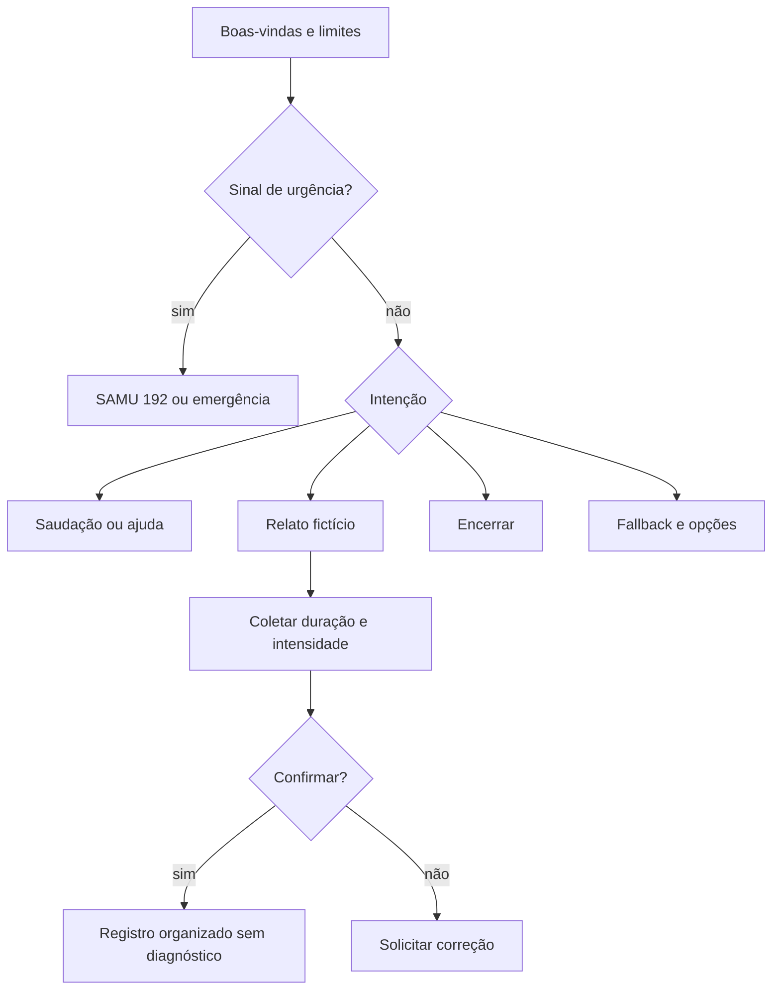

# Fluxo conversacional CardioIA

Versão: 1.0.0. Data: 24/08/2026. Dados de treino: exclusivamente
fictícios. Autor/revisor acadêmico: preencher antes da entrega.

## Prioridade dos nós

1. `welcome`: apresenta finalidade e limites.
2. `sinal_urgencia`: resposta fixa de segurança, antes de qualquer fluxo comum.
3. `saudacao` e `ajuda`: orientam o uso.
4. `relatar_sintoma`: coleta informação complementar sem interpretar.
5. `confirmar`/`negar`: usa `em_confirmacao` para controlar o contexto.
6. `encerrar`: finalização com lembrete de segurança.
7. `anything_else`: fallback recuperável.

## Intents

`saudacao`, `ajuda`, `relatar_sintoma`, `confirmar`, `negar`, `encerrar` e
`sinal_urgencia`. Cada intent possui ao menos cinco exemplos, com variações não
idênticas para reduzir sobreposição.

## Entities

- `sintoma`: palpitação, tontura, falta de ar e desconforto no peito;
- `duracao`: minutos, horas e dias;
- `intensidade`: leve, moderada e forte.

As entidades apenas estruturam termos presentes na mensagem. Não inferem causa,
gravidade clínica ou tratamento.

## Contexto

- `em_confirmacao`: indica que o assistente aguarda confirmação ou correção;
- `relato_confirmado`: marca o fim do fluxo demonstrativo.

O backend mantém somente um UUID público e, no perfil v2, um session ID interno
do Watson. O identificador interno nunca é enviado ao navegador.
